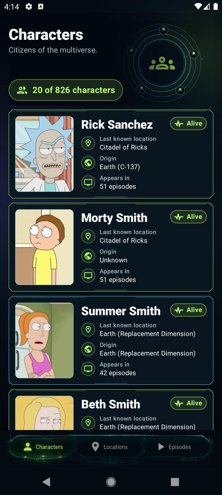
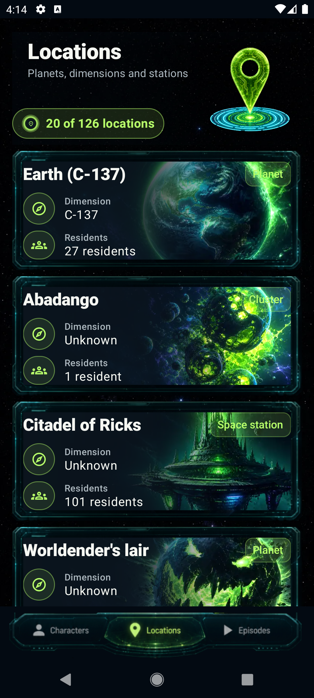
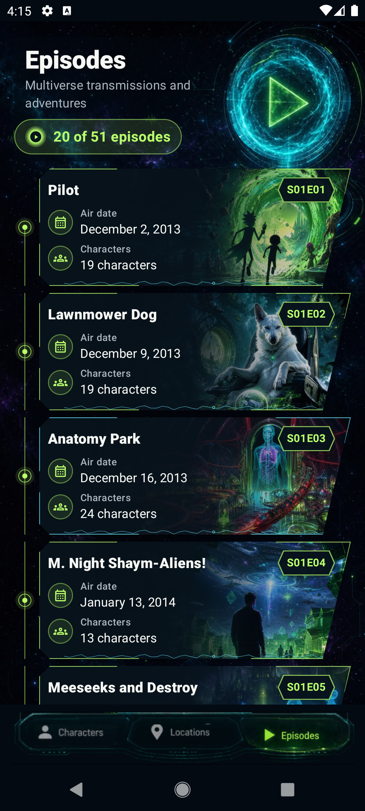
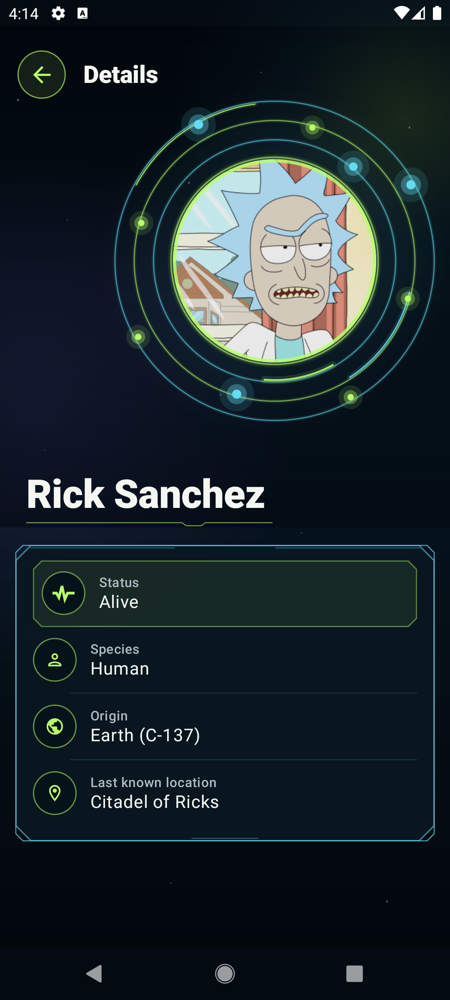
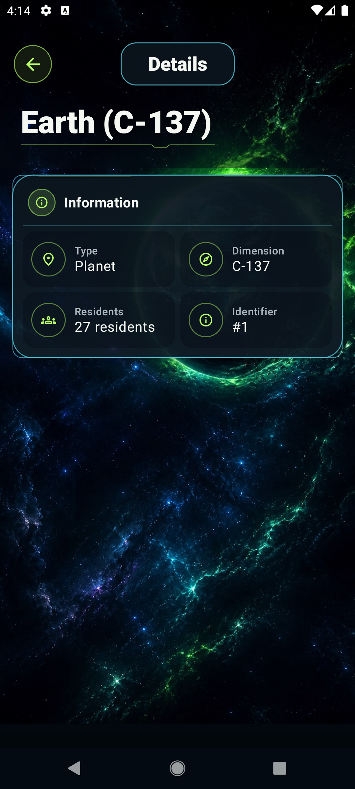
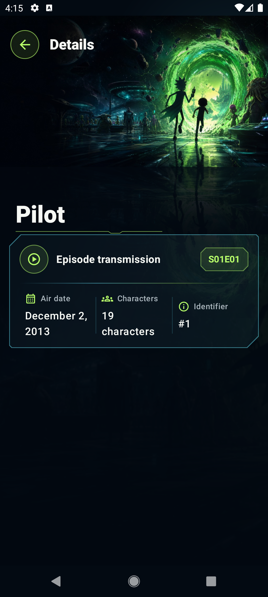
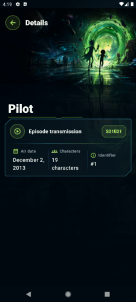
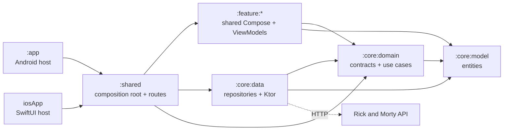

<div align="center">

# Rick and Morty · Clean Architecture Compose

A Kotlin Multiplatform reference implementation for Android and iOS with one shared
Compose UI, explicit boundaries, unidirectional data flow and testable architecture.

[](https://github.com/Deiivid/Android-Clean-Architecture-Sample/actions/workflows/ci.yml)


[Screens](#screens) · [Video](#video-tour) · [Architecture](#architecture) · [Modules](#modules) · [Stack](#technology) · [Run](#getting-started) · [Secrets](#configuration-and-secrets) · [Quality](#quality-gates)

</div>

## Screens

<table>
  <tr>
    <td></td>
    <td></td>
    <td></td>
  </tr>
  <tr>
    <td align="center"><strong>Characters</strong></td>
    <td align="center"><strong>Locations</strong></td>
    <td align="center"><strong>Episodes</strong></td>
  </tr>
  <tr>
    <td></td>
    <td></td>
    <td></td>
  </tr>
  <tr>
    <td align="center"><strong>Character detail</strong></td>
    <td align="center"><strong>Location detail</strong></td>
    <td align="center"><strong>Episode detail</strong></td>
  </tr>
</table>

The Android and iOS apps render these same shared screens and consume the three catalog resources exposed by the public Rick and Morty API. Each destination owns its state, automatic pagination and retry behavior while route-based navigation preserves destination state. Selecting any character, location or episode opens a detail route from the already loaded model, without a second backend request.

## Video tour

<p align="center">
  <a href="docs/media/catalog-tour.mp4">
    
  </a>
  <br>
  <strong>▶ Watch the complete app walkthrough</strong><br>
  Characters · Locations · Episodes · All detail screens
</p>

## Why this repository exists

This project is intentionally small enough to understand and structured enough to scale. It demonstrates the decisions that usually matter when a mobile codebase grows:

- Shared Compose UI, navigation, resources, presentation, domain and data code for Android and iOS.
- Thin platform hosts: one Android `Activity` and one SwiftUI wrapper.
- Pure Kotlin model and domain modules with no platform framework dependency.
- Repository contracts owned by the domain and implemented in the data layer.
- Typed `CatalogResult`/`CatalogError` failures instead of leaking exceptions across boundaries.
- Stateless Compose screens driven by immutable `StateFlow` UI state.
- Automatic server pagination with duplicate-request protection, append errors and retry.
- Route-based Navigation Compose with nested list/detail flows for every catalog on both platforms.
- Explicit DTO-to-domain mappers instead of leaking network models into the UI.
- Spanish/English resource-backed copy, localized API values, large-text layouts and TalkBack semantics.
- Ktor networking with OkHttp on Android and Darwin on iOS.
- Environment-aware configuration without committing local credentials.
- Android host and iOS simulator tests, Android instrumentation, lint, static analysis, formatting, coverage and both host builds.
- Design, testing and AI-agent instructions versioned with the code.

## Architecture

The dependency rule points inward. Domain code does not know Ktor, Compose, Android or iOS; outer layers depend on its contracts.



In plain terms: `core:domain` defines what data the application needs through repository interfaces; `core:data` implements those interfaces; and `shared` connects both sides and owns the product UI. The Android and iOS hosts only start that shared application. The domain never depends on data.

The presentation layer follows unidirectional data flow:

```text
UI event → ViewModel → Use case → Repository contract → Repository implementation → API
   UI  ← immutable UiState ← CatalogResult<Page<Model>, CatalogError> ←───────────┘
```

Every feature handles initial loading, content, empty results, initial errors, incremental loading and retry without moving business logic into Composables.

## Modules

| Module | Responsibility | Key dependencies |
|---|---|---|
| `:app` | Thin Android host, manifest and packaging | Shared |
| `iosApp` | Thin SwiftUI/Xcode host | Shared framework |
| `:shared` | Composition root, route graph, bottom navigation, theme and build configuration | Features, data, domain |
| `:feature:characters` | Character list/detail UI, state, pagination and accessibility semantics | Domain, model |
| `:feature:locations` | Location list/detail UI, state, pagination and accessibility semantics | Domain, model |
| `:feature:episodes` | Episode list/detail UI, state, pagination and accessibility semantics | Domain, model |
| `:core:domain` | Repository contracts and use cases | Model only |
| `:core:model` | Framework-free business entities | None |
| `:core:data` | Ktor service, DTOs, mappers, repositories and platform HTTP engines | Domain, model |
| `:core:designsystem` | Shared dimensions and design tokens | Compose UI |
| `:core:testing` | Shared coroutine and ViewModel test utilities | Test libraries only |

### Backend coverage

| Resource | Endpoint | Behavior |
|---|---|---|
| Characters | `/character` | Paginated list with images loaded through Coil |
| Locations | `/location` | Paginated list with type and dimension metadata |
| Episodes | `/episode` | Paginated list with code and air-date metadata |

Failures cross the data boundary as `CatalogResult<Page<T>, CatalogError>`. Connectivity, HTTP, serialization and unexpected failures are finite domain values; coroutine cancellation is rethrown. Presentation receives typed errors, never raw exceptions, and never silently converts a failure into an empty list.

## Technology

| Area | Selection |
|---|---|
| Language and runtime | Kotlin 2.3.21, Java 17, Swift 5 |
| UI and navigation | Compose Multiplatform 1.10.3, Material 3, Navigation Compose 2.9.2 |
| State and concurrency | ViewModel, StateFlow, Coroutines 1.11.0 |
| Composition | Explicit `CatalogAppComponent` at the shared root |
| Network | Ktor 3.4.3, kotlinx.serialization, OkHttp/Darwin engines |
| Images | Coil 3.4.0 |
| Testing | Kotlin Test, Turbine, Coroutines Test, Ktor MockEngine, Compose UI Test |
| Quality | Android Lint, Detekt 1.23.8, KtLint Gradle 14.2.0, Kover 0.9.8 |
| Build | AGP 9.0.0, Gradle 9.1.0, Android SDK 30–36, Xcode |

The Android application remains a separate host, as required by the AGP Kotlin Multiplatform plugin. Shared libraries use `com.android.kotlin.multiplatform.library`, and versions are centralized in [`gradle/libs.versions.toml`](gradle/libs.versions.toml).

## Getting started

### Requirements

- Android Studio with support for Android Gradle Plugin 9.0.0.
- JDK 17.
- Android SDK 36.
- macOS with Xcode for iOS builds.

### Build

```bash
git clone https://github.com/Deiivid/Android-Clean-Architecture-Sample.git
cd Android-Clean-Architecture-Sample
./gradlew :app:assembleDebug
```

The public API requires no credentials.

- Android: open the project in Android Studio and run `app` on Android 11 or newer.
- iOS: open `iosApp/iosApp.xcodeproj`, choose an iPhone simulator and run `iosApp`.

## Configuration and secrets

The repository includes a complete, inspectable example of mobile configuration handling. Four optional credential values are added by the shared Ktor client, omitted when blank and redacted from HTTP logs:

| Name | GitHub configuration | Request usage |
|---|---|---|
| `RICK_AND_MORTY_API_KEY` | Secret | `X-Api-Key` |
| `DEMO_CLIENT_ID` | Variable | `X-Client-Id` |
| `DEMO_TENANT_ID` | Variable | `X-Tenant-Id` |
| `DEMO_ACCESS_TOKEN` | Secret | `Authorization: Bearer …` |

Credential resolution order:

```text
Environment variable → Gradle property → ignored secrets.properties → empty
```

`RICK_AND_MORTY_BASE_URL` follows environment variable → Gradle property → public fallback. Local setup is optional:

```bash
cp secrets.properties.example secrets.properties
./gradlew secretsStatus
```

Three dedicated Gradle tasks demonstrate the full workflow without printing values:

```bash
./gradlew secretsStatus                 # Show source and configured/missing status
./gradlew importSecretsFromEnvironment  # Persist environment values locally
./gradlew verifyEnvironmentVariables    # Strict optional credential check
```

This prevents accidental source-control exposure; it does not make values embedded in an APK or iOS app truly secret. Long-lived credentials belong on a trusted backend. The complete contract, CI mapping and threat boundary are documented in [`docs/SECRETS.md`](docs/SECRETS.md).

## Quality gates

The local and CI verification command is:

```bash
./gradlew testAndroidHostTest lintDebug detekt ktlintCheck :koverVerify \
  :app:assembleDebug --warning-mode all
./gradlew iosSimulatorArm64Test \
  :shared:linkDebugFrameworkIosSimulatorArm64 \
  :shared:linkDebugFrameworkIosArm64 --warning-mode all
xcodebuild -project iosApp/iosApp.xcodeproj -scheme iosApp \
  -sdk iphonesimulator -destination 'generic/platform=iOS Simulator' \
  CODE_SIGNING_ALLOWED=NO build
```

Portable tests run on Android host and iOS simulator. Coverage includes use-case delegation, complete DTO mapping, Ktor malformed/truncated responses, typed repository failures, cancellation propagation, credentials, save/restore round trips and every ViewModel transition for the three catalogs. Android Compose tests cover actionable grouped semantics, live-region loading announcements, bottom-navigation selection and its large-text/compact-width adaptations.

Instrumented tests require a connected device or emulator and remain separate from the headless CI gate:

```bash
./gradlew :app:connectedDebugAndroidTest \
  :shared:connectedAndroidDeviceTest \
  :feature:characters:connectedAndroidDeviceTest \
  :feature:locations:connectedAndroidDeviceTest \
  :feature:episodes:connectedAndroidDeviceTest
```

Kover enforces a 60% minimum over an explicit application-logic scope: domain, data mappers/repositories/credential headers, feature UI-state models and ViewModels. Generated code, resources, themes and Compose screen rendering are excluded; UI behavior is verified separately. GitHub Actions runs the Android gate on Linux, the iOS gate on macOS and `secretsStatus` on every push and pull request.

Engineering decisions are kept next to the implementation:

- [`docs/specs/SDD-rick-and-morty-catalog.md`](docs/specs/SDD-rick-and-morty-catalog.md) — architecture, boundaries and acceptance criteria.
- [`docs/testing/TDD-rick-and-morty-catalog.md`](docs/testing/TDD-rick-and-morty-catalog.md) — automated coverage, manual checks and planned scenarios.
- [`AGENTS.md`](AGENTS.md) — repository-wide agent contract, refined by module-level instructions.

## Deliberate scope

This reference focuses on KMP modular architecture, shared mobile UI, remote catalogs, typed failures, pagination, route navigation, accessible Compose UI, configuration and testability. It does not claim offline persistence, search/filtering, user authentication, deep-link restoration of catalog details or production credential storage.

Data is provided by the [Rick and Morty API](https://rickandmortyapi.com/). This educational project is not affiliated with the API or the television series.
